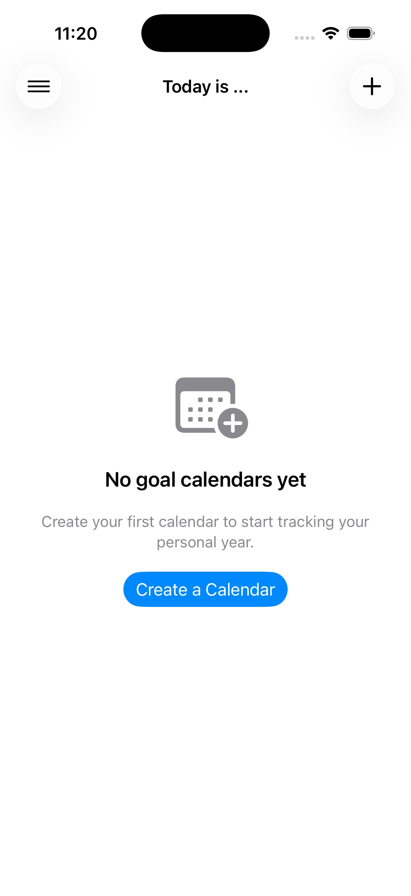
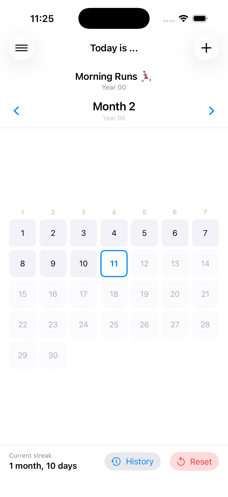
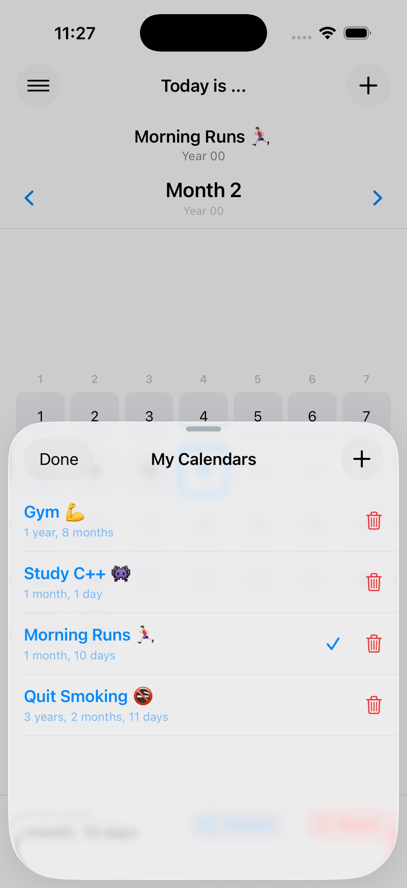
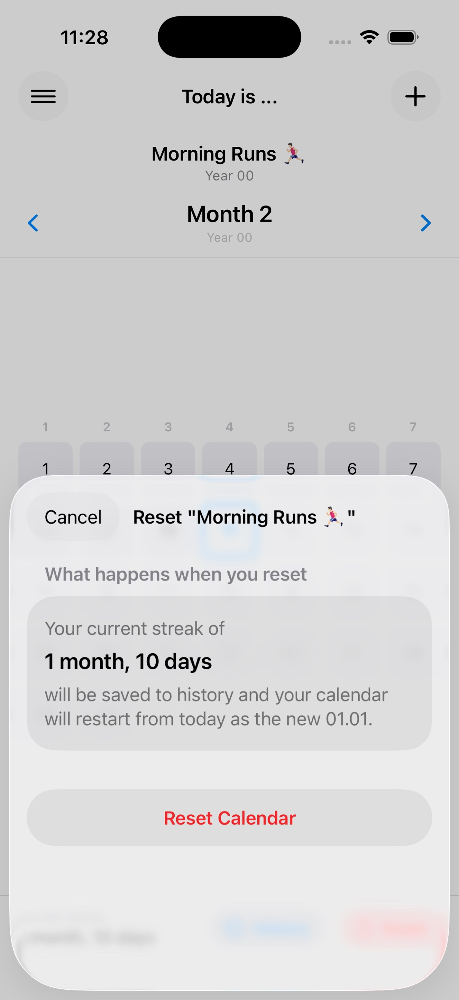
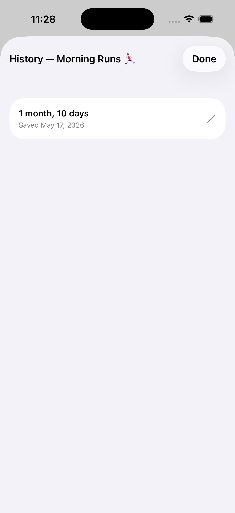
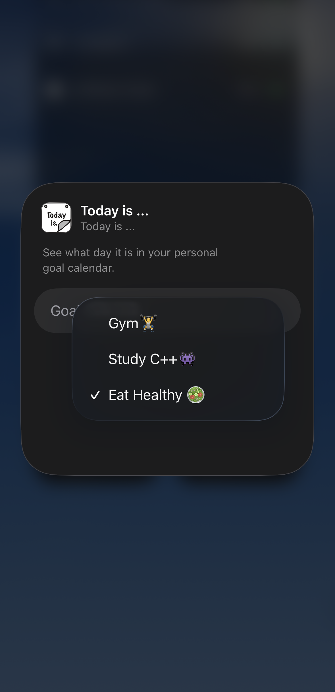
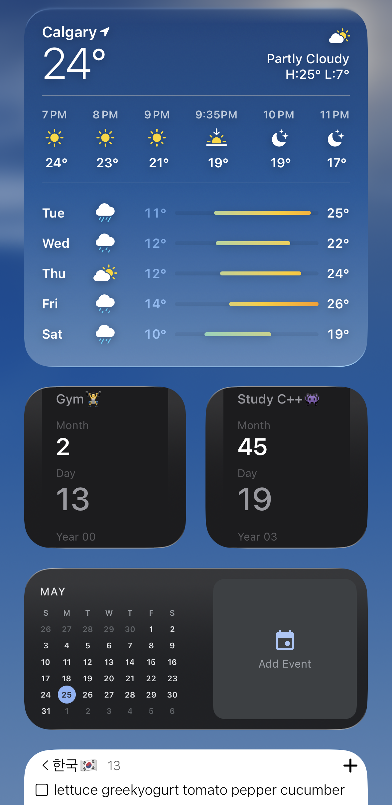
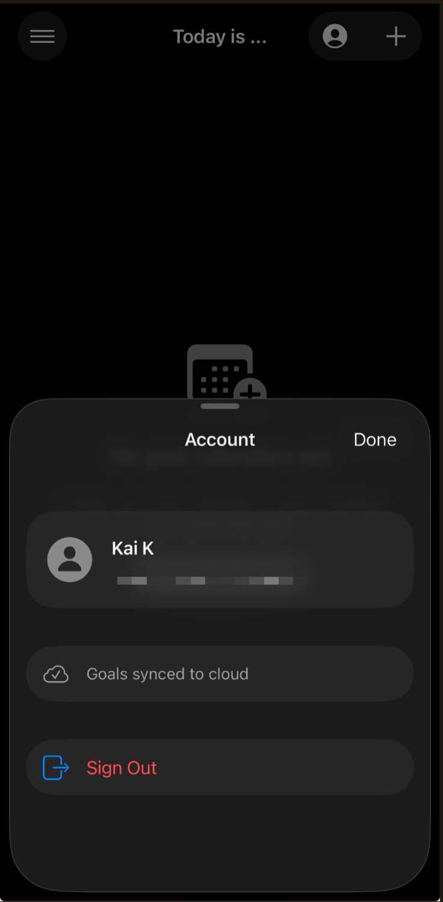

  

<h1 align="center">Today is ...</h1>

A personal goal calendar app for iOS built with SwiftUI.

---

## Concept

Most people wait for January 1st to start their resolutions. **Today is ...** lets you create your own personal calendar where *any* day can be your January 1st — one per goal.

Instead of tracking dates on a wall calendar, you track how old you are *as a person pursuing that goal*:

> *"I'm 2 years old as a gym-goer."*  
> *"I'm 8 months old as a book worm."*  
> *"I'm 3 years, 2 months old as a non-smoker."*  
> *"I'm 1 month, 10 days old as a morning runner."*

Each goal gets its own calendar starting from the day you committed to it. The focus stays on consistency — not the date on the wall.

---

## Screenshots

**App**

  
  
  
  
  

**Widget & Cloud Sync**

  
  
  

---

## Features

- Create multiple goal calendars, each with its own personal start date
- Month-by-month calendar grid showing your personal day count
- Current streak displayed in years, months, and days
- Reset a calendar at any time — your streak is automatically saved to history
- Streak history is editable (can only be reduced, not inflated)
- Sidebar to switch between goal calendars

### Home Screen Widget
- Small widget that shows the current month, day, and year for any goal
- Tap and hold to pick which goal calendar to display
- Refreshes daily at midnight

### Cloud Sync (Google Sign-In)
- Sign in with Google to sync all your goal calendars across devices
- Data is backed up to Firebase automatically on every change
- Sign-in is opt-in — the app works fully offline without an account
- On first sign-in: existing cloud data is downloaded, or local data is uploaded

---

## Built With

- Swift / SwiftUI
- SwiftData (local persistence)
- WidgetKit
- Firebase (Firestore + Auth)
- Google Sign-In
- Xcode 26
- iOS 17+

---

## Author

Kai Kim  
[github.com/somekaicodes](https://github.com/somekaicodes)
